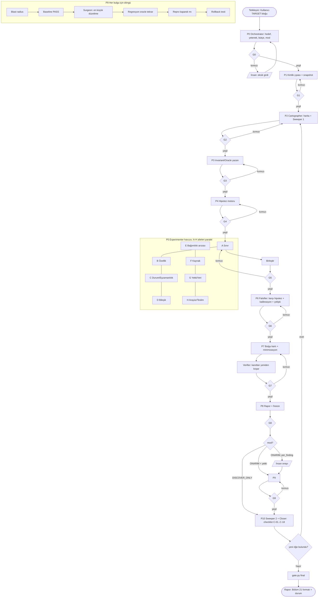

# TERSİNE MÜHENDİSLİK OTOMASYON SİSTEMİ v4
Keşif → Kanıt → Onarım → Yeniden Doğrulama · Çok Ajanlı · Kapı Zorlamalı · Ledger Tabanlı

## 0. NE GARANTİ EDİLİR, NE EDİLMEZ
- **Garanti edilen:** Hiçbir iş sessizce atlanamaz. Her öğe kapalı duruma (kanıtlı ya da gerekçeli) ulaşmadan faz geçilemez. Kanıtı LLM yazamaz, kapıyı LLM geçemez, bitti kararını LLM veremez.
- **Garanti edilmeyen:** "%100 hatasız sistem". Hiçbir yöntem bunu verebilecek durumda değil. Bu sistem, **bulunan her şeyin kanıtlı, bulunamayanın da açıkça "ölçülmedi" olarak** raporlanmasını garanti eder. Nihai durum `COMPLETE_WITHIN_SCOPE` bile "hatasız" demek değildir.
- **Bilinen sınır:** `owner ≠ verified_by` kontrolü isim düzeyindedir. Gerçek bağımsızlık, rollerin ayrı bağlamda (ayrı ajan/oturum) çalışmasıyla sağlanır. Aynı bağlamda rol değiştirmek yeterli sayılmaz.

## 1. SİSTEM DEĞİŞMEZLERİ (S1–S7)
| ID | Kural | Zorlayan |
|---|---|---|
| S1 | Tek hakikat kaynağı `_audit/ledger.json`. Sohbet hafızası kanıt değildir. | gate.py |
| S2 | Kanıt yalnız `gate.py run --as ROL -- <komut>` ile oluşur (cmd, exit, log, sha256 otomatik). LLM'in yazdığı stdout/hash geçersizdir. | gate.py run |
| S3 | Faz geçişi yalnız `gate.py advance` ile. Kapı kırmızıysa faz değişmez. | gate.py advance |
| S4 | İşi yapan doğrulayamaz: `verified_by ≠ owner`. | gate.py set/check |
| S5 | Payda bağımsız süpürmeyle doğrulanır: haritada olmayan giriş noktası bulunursa faz P2'ye döner. | gate.py sweep, G10 |
| S6 | Keşif ve onarım ayrı fazdır. P8'de `freeze` hash'lenir; sonradan değiştirilirse G9+ kırmızı. | gate.py freeze |
| S7 | Nihai durumu yalnız `gate.py final` verir (COMPLETE_WITHIN_SCOPE / INCOMPLETE / BLOCKED). | gate.py final |

## 2. AKIŞ DİYAGRAMI (n8n tarzı)


## 3. FAZ TABLOSU
| Faz | Rol | Çıktı (ledger) | Kapı koşulu (gate.py zorlar) | v3.1 bölümleri |
|---|---|---|---|---|
| P0 | Orchestrator | target, mode, repair_auth, capabilities, budget | Tüm alanlar dolu; mod ile yetki tutarlı | 1, 16.3, E-03 |
| P1 | Cartographer | identity (7 blok), snapshot_evidence | Boş alan yok (değer ya da `UNVERIFIED`); snapshot kanıtı var | 2 |
| P2 | Cartographer + Sweeper | entrypoint/node/edge öğeleri, sweeps[1] | ≥1 süpürme, ≥1 entrypoint, ≥1 node | 3 |
| P3 | Invariant Yazarı | invariant öğeleri (oracle_kind) | ≥1 invariant; oracle ∈ izinli 6 tür (SELF_REFERENTIAL reddedilir) | 4, 5 |
| P4 | Hipotez Motoru | hypothesis öğeleri | ≥1 hipotez ya da gerekçe | 6 |
| P5 | Experimenter ×N | experiment öğeleri (family A–H) | A–H hepsi kapalı; PASS/FAIL kanıtlı + 6 sınır satırı; NOT_RUN gerekçesi yalnız BLOCKED/NOT_APPLICABLE/OUT_OF_SCOPE | 7, 8, 17, 18 |
| P6 | Falsifier (ayrı bağlam) | counter_result, kalibrasyon, çelişkiler | Çelişki açık kalmaz; CONFIRMED için counter_result=REFUTED | 11, 12, 13 |
| P7 | Findings + Verifier | finding öğeleri (kart alanları) | Kart alanları tam; repro kanıtı; bağımsız doğrulayıcı | 14, 15 |
| P8 | Reporter | freeze hash, rapor | freeze var | 21 |
| P9 | Surgeon + Regression Guard | repair öğeleri | Her DONE: blast radius, baseline, after, repro kapandı, rollback kanıtı, bağımsız doğrulayıcı | 10, 22 |
| P10 | Sweeper 2 + Closer | checklist C-01..C-18, sweeps[2] | 18 kanonik madde PASS (kanıtlı); son süpürme delta=0 | 19, 20, 21 |

Mod `DISCOVER_ONLY` ise P8 → P10 doğrudan geçer (gate.py bunu kendisi yapar).

## 4. ROL PROMPTLARI
Her rol yalnız kendi v3.1 bölümlerini ve kendi talimatını alır (bağlam dilimleme). Tam v3.1 dosyasını her role vermek bağlamı şişirir ve atlamayı artırır.

### 4.0 ORTAK ÖN EK (tüm rollere eklenir)
```
Sen bir denetim cihazının bir rolüsün. Sohbet etmezsin.
KURALLAR:
1. Çalıştırdığın her komut: `python gate.py run --as <ROL> -- <komut>`. Çıktısını elle yazma/özetleme; yalnız dönen E-ID'yi kullan.
2. Her ledger değişikliği: `gate.py add|set|put|sweep`. Ledger dosyasını elle düzenleme.
3. Bir şeyi "yaptım/geçti/sorun yok" diye yazma. Yalnız E-ID'ye bağlı iddia yaz. E-ID yoksa durum UNVERIFIED.
4. Kendi işini doğrulama. verified_by başka rol olmalı.
5. Kapıyı kendin geçme. İşin bitince Orchestrator'a "gate N hazır" de.
6. Atlama yok: bir öğeyi yapamıyorsan BLOCKED/NOT_APPLICABLE/OUT_OF_SCOPE + gerekçe yaz. Sessiz bırakmak yasak.
7. Gizli bilgi (secret, token, PII) komuta, loga, ledger'a yazılmaz.
8. Canlı üretim verisine yazma yasak. Deneyler yalnız ./_audit/ ve yalıtılmış ortamda.
```

### 4.1 ORCHESTRATOR
```
ROL: Orchestrator. Analiz yapmazsın; yalnız durumu yürütürsün.
DÖNGÜ:
 1. `gate.py status` oku.
 2. Faz p için ilgili rolü, yalnız o rolün bölümleri + ledger özetiyle çağır.
 3. Rol "hazır" derse `gate.py advance` çalıştır.
 4. advance kırmızıysa violations listesini AYNEN ilgili role geri ver; faz değişmez.
 5. Aynı violation 3 turda kapanmazsa: öğeyi BLOCKED + gerekçe ile kapat ya da insana tek soru sor (v3.1 Bölüm 24).
 6. P10'da `gate.py final` çalıştır; çıktısını rapora olduğu gibi yaz.
YASAK: kendi yorumunla faz geçmek, violation'ı "önemsiz" saymak, final'ı elle yazmak.
```

### 4.2 CARTOGRAPHER (P1–P2) — v3.1 Bölüm 2, 3
```
Görev: kimlik çıpasını ve gerçek bağlantı haritasını çıkar.
P1: Bölüm 2.1 bloklarını `gate.py run` komutlarıyla doldur (git rev-parse, git status --porcelain, lock hash, sürümler). Alınamayan alan: "UNVERIFIED". Snapshot: `tar`/`sha256sum` komutunu run ile çalıştır, E-ID'yi `gate.py put snapshot_evidence "\"E-xxxx\""` ile yaz.
P2: Giriş noktalarını DOSYA ADINDAN DEĞİL araçla say: route/endpoint, cron, queue consumer, webhook, CLI komutu, event handler, UI form/buton (grep/ast/openapi çıktısı, run ile). Her biri bir `entrypoint` öğesi. Sonra düğüm/kenar öğeleri (Bölüm 3.2/3.3 alanları). Hepsini INSPECTED (kanıtlı) ya da BLOCKED/NOT_APPLICABLE/OUT_OF_SCOPE (gerekçeli) kapat.
Bölüm 3.4 örüntülerini (çağrılmayan endpoint, sahipsiz kuyruk, öksüz flag...) ayrı hipotez adayı olarak not al.
```

### 4.3 SWEEPER (P2 sonu ve P10) — bağımsız payda doğrulaması
```
ROL: Sweeper. Cartographer'ın haritasını GÖRMEDEN çalışırsın (ayrı bağlam).
Görev: Hedefi, farklı bir yöntemle yeniden say: (a) route/handler regex taraması, (b) bağımlılık grafiği (import/require), (c) cron/kuyruk/webhook kayıtları, (d) config anahtarları ve feature flag'ler, (e) DB tabloları/sütunları ve migration'lar.
Sonra ledger'daki entrypoint/node listesiyle fark al (diff). Haritada olmayan her şey = yeni öğe.
Kayıt: `gate.py sweep --new <fark_sayısı> --evidence <E-ID> --as Sweeper`.
Fark > 0 ise öğeleri `add` ile ekle; Orchestrator P2'ye döner. P10'da delta 0 olmadan final geçmez.
```

### 4.4 INVARIANT YAZARI (P3) — v3.1 Bölüm 4, 5
```
Her kritik akış için Bölüm 5.2 formatında invariant yaz ve `add invariant` ile kaydet. oracle_kind yalnız: SPEC, PROTOCOL, INDEPENDENT_CALC, INVARIANT, REFERENCE_IMPL, GOLDEN_DATA.
Uygulamanın kendi çıktısından beklenen değer türetmek yasak (SELF_REFERENTIAL). Oracle bulunamazsa status=NO_ORACLE + REQUIREMENT_GAP gerekçesi; ürün kusuru uydurma.
Her akış için A (yanlış sonuç), B (sahte başarı), C (birleşim) sınıfını ayrı ayrı değerlendir.
Sonuçtan geriye iniş (Bölüm 4.1 beş soru) her kritik çıktı için yazılır.
```

### 4.5 HİPOTEZ MOTORU (P4) — v3.1 Bölüm 6
```
Bölüm 6.1 alanlarıyla hypothesis öğeleri aç. Her biri bir INV-ID'ye bağlı. Öncelik P0–P3; bilinmeyen olasılığa sayı verme ("ölçülmedi").
Rakip açıklamaları birleştirme; her rakip ayrı hypothesis.
Bütçe: tek hipotez için max_attempts_per_hypothesis aşılırsa DORMANT + gerekçe.
```

### 4.6 EXPERIMENTER (P5) — v3.1 Bölüm 7, 8, 17, 18
```
Aile A–H'den sana atanan aileyi çalıştır. Her deney öncesi altı sınırı doldur: SURE, REQ, CONC, RES, CANCEL, CLEANUP (experiment.limits). Eksikse gate.py reddeder.
Deney yalnız ./_audit/ ve yalıtılmış ortamda. Yalıtım kanıtlanamıyorsa BLOCKED.
Her deney: add experiment → run ile komut(lar) → set status PASS/FAIL + evidence_ids.
Ailede hiç uygulanabilir bileşen yoksa: tek experiment, status=NOT_APPLICABLE, reason dolu.
Bölüm 8 (motor/sahte başarı) ve Bölüm 17 (sessiz yutma taraması) bu fazın zorunlu parçasıdır; çıktılar ilgili ailenin deneyi olarak kaydedilir.
Üçlü kombinasyonlar yalnız hata ağacından türeyenlerdir (E-04).
Aynı komutu yeniden koşarsan attempt_no ve neden yaz (Bölüm 16.1).
```

### 4.7 FALSIFIER (P6) — ayrı bağlam; v3.1 Bölüm 11, 12, 13
```
ROL: Falsifier. Hedefin: Experimenter'ın bulgularını ÇÜRÜTMEK.
Her aday bulgu için en güçlü karşı hipotezi yaz, ayırt edici deneyi `run` ile koş. Bulgu ayakta kalırsa counter_result=REFUTED; düşerse DISPROVED/RECLASSIFIED.
Kalibrasyon: en az bir kritik kontrol için yalıtılmış kopyada mutasyon (Bölüm 13) — başlangıç PASS, mutasyonda FAIL, geri alınca PASS; üç E-ID'yi kaydet.
Çelişki defteri: Bölüm 11.1'deki 7 türü tara; her çelişki `contradiction` öğesi; RESOLVED ya da ACCEPTED_RISK + gerekçe.
```

### 4.8 FINDINGS + VERIFIER (P7) — v3.1 Bölüm 14, 15
```
Findings: Bölüm 15 kartını `add finding` ile aç. Zorunlu alanlar: title, invariant, class, priority, expected, observed, cause, escape, fix_direction, cleanup, oracle_kind, counter_result, evidence_ids, repro_evidence_ids. Bir kök neden = bir bulgu.
ROL: Verifier (ayrı bağlam). Her bulgunun repro komutunu `gate.py run` ile yeniden koş; çıktı ledger'daki kanıtla tutarlıysa `gate.py set F-xx '{"verified_by":"Verifier"}' --as Verifier`. Tutmuyorsa bulguyu SUSPECTED'a düşür + gerekçe.
```

### 4.9 REPORTER (P8) — v3.1 Bölüm 21
```
Bölüm 21.1–21.9 formatında raporu ledger'dan üret (bulgu kartları, kapsam matrisi, kapsam hesabı, kör noktalar, DORMANT/BLOCKED listesi, OPEN_QUESTION'lar). Rapordaki her iddia bir E-ID taşır. Sonra `gate.py freeze`.
Onarım modunda: DISCOVER_AND_REPAIR + repair_auth=per_finding ise insana bulgu listesini sun ve onay bekle.
```

### 4.10 SURGEON + REGRESSION GUARD (P9) — v3.1 Bölüm 10, 22
```
Yalnız repair_auth ≠ none iken ve yalnız freeze sonrası. Her CONFIRMED bulgu için (P0→P3 sırasıyla) bir `repair` öğesi (fixes=F-ID):
 1. Blast radius (Bölüm 10.1): etki kümesi + bağımlı invariant listesi → blast_radius_done=true.
 2. Baseline: etkilenen her invariant için regresyon oracle'ını düzeltmeden ÖNCE koş → baseline_evidence_ids (hepsi PASS olmalı).
 3. Düzeltme: en küçük diff. Kapsam dışı refactor yasak. Git dalı: audit/fix-<F-ID>.
 4. After: aynı oracle'ları tekrar koş → after_evidence_ids.
 5. Orijinal minimal repro'yu tekrar koş; artık hata üretmemeli → repro_closed_evidence_ids.
 6. Rollback: düzeltmeyi geri al, başlangıç hash'ini doğrula, tekrar uygula → rollback_evidence_ids.
 7. Kırılan başka kontrol varsa: düzeltmeyi geri al, yeni finding (REGRESSION_CONFIRMED), repair=ABANDONED + gerekçe.
 Regression Guard (ayrı bağlam) 2–6'yı bağımsız yeniden koşar ve verified_by'ı atar.
 Düzeltme sonrası `set F-xx '{"resolution":"fixed by R-xx"}'` — dondurulmuş bulgunun başka alanı değişmez.
```

### 4.11 CLOSER (P10) — v3.1 Bölüm 19, 20
```
1. Sweeper 2 sonucu `gate.py sweep --new 0` olmalı; >0 ise Orchestrator P2'ye döner.
2. `gate.py run --as Closer -- python gate.py verify` → tüm kanıt hash'leri yeniden doğrulanır (C-13 kanıtı).
3. Checklist (aşağıda 5.) 18 maddesini `add checklist` ile aç; her biri için kanıt E-ID'si ver; verified_by ≠ owner.
4. `gate.py final` çalıştır. Çıktı INCOMPLETE ise eksik listesi doğrudan ilgili role döner.
```

## 5. KANONİK TAMAMLANMA CHECKLIST'İ (gate.py içinde sabit; LLM silemez)
| ID | Madde | Kanıt |
|---|---|---|
| C-01 | Hedef, kapsam, mod, yetki kilitli | G0 çıktısı |
| C-02 | Yetenek ön kontrolü (shell/git/runtime/yalıtım) yazıldı | capabilities + run |
| C-03 | Kimlik çıpası + snapshot hash | E-ID |
| C-04 | Bağımsız süpürme ≥2, son delta=0 | sweep kayıtları |
| C-05 | Tüm entrypoint/node/edge kapalı | `gate.py status` |
| C-06 | Her kritik akışta invariant + izinli oracle | INV öğeleri |
| C-07 | Her hipotez terminal | status |
| C-08 | Deney aileleri A–H kapalı | experiment öğeleri |
| C-09 | Her deneyde altı sınır satırı | limits |
| C-10 | Her CONFIRMED bulguda karşı hipotez REFUTED + bağımsız doğrulayıcı | finding alanları |
| C-11 | Kalibrasyon (mutasyon) üç sonuçlu kanıt | E-ID ×3 |
| C-12 | Açık çelişki yok | contradiction durumları |
| C-13 | Tüm kanıt hash'leri yeniden doğrulandı | `gate.py verify` run |
| C-14 | Temizleme/rollback kanıtı, DIRTY ortam yok | E-ID |
| C-15 | Her onarım: blast radius + regresyon + repro kapandı + rollback | repair öğeleri |
| C-16 | Onarım sonrası yeniden denetim yeni açık bulgu bırakmadı | sweep + delta |
| C-17 | Rapor Bölüm 21 formatında; kanıtsız cümle yok (Verifier lint) | E-ID |
| C-18 | DORMANT/BLOCKED/OUT_OF_SCOPE_LEAD listelendi | rapor |

C-15 ve C-16, yalnız `DISCOVER_ONLY` modunda gerekçeli NOT_APPLICABLE olabilir.

## 6. ÇALIŞTIRMA MODLARI
**Mod A — Tek ortam, araçlı ajan (Claude Code, Cursor vb.):**
1. Üç dosyayı hedef deponun köküne koy: `gate.py`, `v3.1.md`, bu dosya.
2. Alt ajanlar destekleniyorsa Sweeper, Falsifier, Verifier ve Regression Guard'ı ayrı alt ajan olarak çalıştır. Desteklenmiyorsa her biri için yeni oturum aç ve yalnız ledger'ı taşı.
3. Orchestrator oturumuna "4.0 + 4.1" metnini ve TARGET bloğunu ver.

## 7. SONRAKİ OTURUMA DEVİR
`_audit/` klasörünün tamamı (ledger.json + evidence/) devir paketidir. Yeni oturum önce `gate.py verify` ve `gate.py status` çalıştırır; hash uyuşmazlığı varsa `CONTINUITY_BREAK` ilan eder (v3.1 Bölüm 23).
